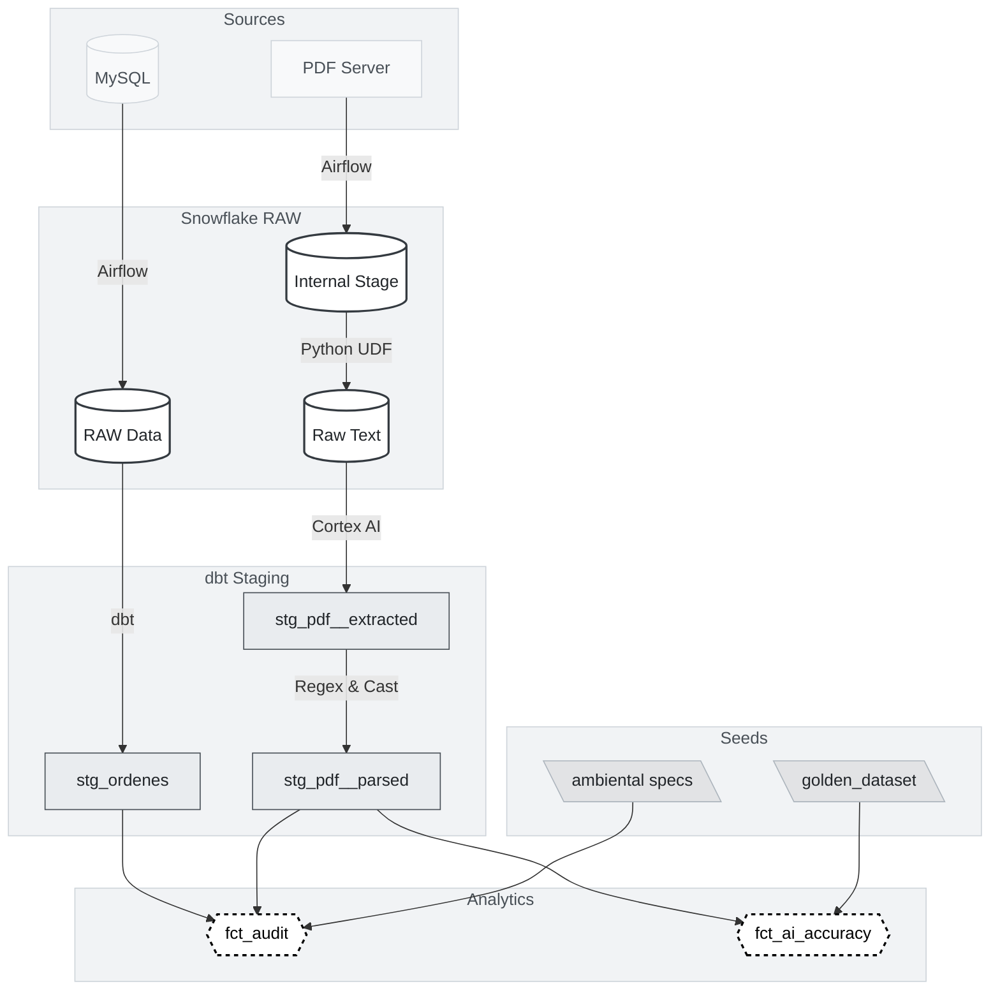
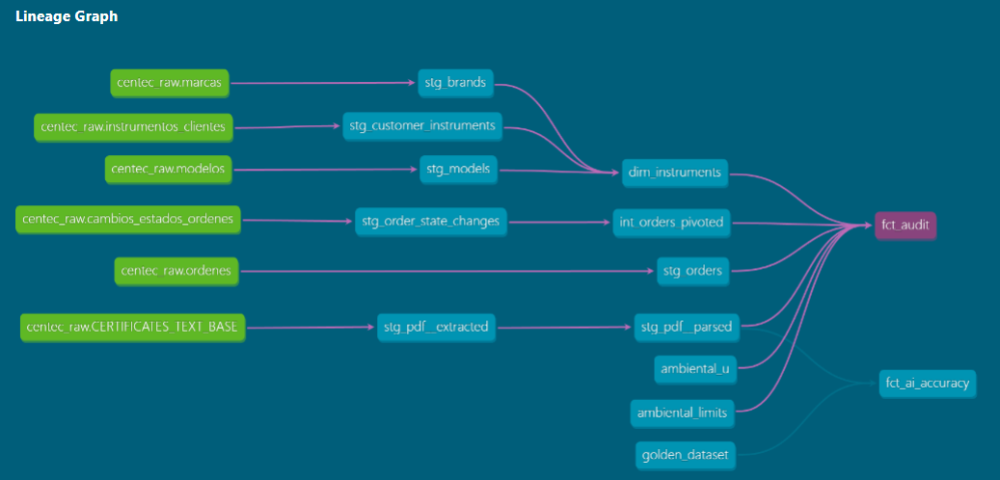

# Certificate Integrity Pipeline

This pipeline detects discrepancies between issued calibration certificates and production records. It extracts structured data from PDFs using an LLM, compares it against the operational database, and flags non-conformities using dbt compliance rules, replacing manual spot-checks with automated daily coverage.

### Overview

  * **Problem:** ISO 17025 accreditation requires strict coherence between the operational database and the final printed PDF certificate delivered to the client. Currently, human auditors verify a limited sample. This leaves the vast majority of the population unaudited, exposing the laboratory to regulatory risk, invalid traceability claims, and compromised certification during external audits.

<br>

  * **Solution:** A daily pipeline that compares database records against the signed certificate content executes full population testing. It ingests the database state and the PDF files, **extracts the PDF text via a Python UDF, parses it into JSON using an LLM, and runs compliance rules against both datasets using dbt**.

<br>

  * **Impact:** The laboratory previously audited a sample before each external assessment. This pipeline runs the same checks daily against every issued certificate, flagging non-conformities as they appear instead of discovering them under audit pressure.

<br>

  * **Technical Detail:** The infrastructure requires Snowflake to execute Python and LLM inference directly where the data resides. The architecture strictly separates ingestion, LLM execution, and business logic to guarantee auditability, control API costs, and measure AI hallucinations.

  >**Architecture Note:** This project builds on the operational analytics platform documented [here](https://github.com/andreslarrahona/operational-analytics-platform). The stack moved from PostgreSQL on-premise to Snowflake to run LLM inference in-warehouse via Cortex AI, avoiding the need to move raw PDF content to an external API.

### AI Extraction Results

The pipeline uses Llama 3.1-8b via Snowflake Cortex to extract structured data from certificate PDFs. Accuracy was measured against a manually verified sample of 30 certificates:

| Field | Accuracy | Primary failure mode |
| :--- | :--- | :--- |
| Serial Number | 73.3% | Non-linear layouts (columns, rotated text) |
| Temperature | 76.7% | Attention drift in dense tables |
| Humidity | 73.3% | Value confusion with adjacent fields |

These results informed two architectural decisions: the `status_ia` triage layer that prevents hallucinated data from reaching the compliance audit, and the `fct_ai_accuracy` fact table that re-runs this benchmark daily against new certificates.


## Architecture and Pipeline Breakdown




### 1\. Infrastructure as Code (Terraform)

The Terraform configuration is split into three files by concern: `main.tf` provisions the database, schemas, stage, and UDF. `resources.tf` defines the raw text table where extracted PDF content lands. `security.tf` creates two service roles — `AIRFLOW_ROLE` and `DBT_ROLE` — and grants them the minimum privileges needed for each layer.

The schema separation (`RAW_DATA`, `STAGING`, `INTERMEDIATE`, `ANALYTICS`) is what makes the RBAC meaningful: Airflow can write to `RAW_DATA` but has no access to the transformation schemas, and dbt can read and write across all schemas but cannot touch the internal stage directly.


<details>
<summary style="font-weight:bold; cursor:pointer">View security.tf: role grants per schema</summary>

```terraform
resource "snowflake_grant_privileges_to_account_role" "airflow_schema_raw" {
  privileges        = ["USAGE", "CREATE TABLE"]
  account_role_name = snowflake_account_role.airflow_role.name

  on_schema {
    schema_name = "${snowflake_database.audit_db.name}.${local.schemas["raw_schema"]}"
  }
}

resource "snowflake_grant_privileges_to_account_role" "dbt_schema_usage" {
  for_each          = local.schemas
  privileges        = ["USAGE", "CREATE TABLE", "CREATE VIEW"]
  account_role_name = snowflake_account_role.dbt_role.name

  on_schema {
    schema_name = "${snowflake_database.audit_db.name}.${each.value}"
  }
}

```

</details>
<br>


### 2\. Data Ingestion (Airflow)

Data movement is orchestrated via Airflow DAGs.

  * **`dag_certificates.py`:** Connects via SSH to the server, diffs against the Snowflake stage, and runs an incremental SFTP upload to avoid reprocessing historical files.
  * **`dag_olap.py`:** Pulls operational tables from MySQL and writes to `RAW_DATA` via `write_pandas`.

### 3\. Unstructured Data Processing (Snowpark & Cortex AI)

The pipeline converts PDF text into structured relational data in two steps: LLM inference and format validation.

  * **`stg_pdf__extracted.sql` (LLM Inference):** Uses `SNOWFLAKE.CORTEX.COMPLETE` (Llama 3.1) with Few-Shot prompting to generate a strict JSON object from the raw text. This model is materialized as `incremental` with batch limits to prevent runaway API costs during daily dbt runs.
  * **`stg_pdf__parsed.sql` (Quality Triage):** A declarative view that unpacks the JSON. It uses safe casting (`TRY_TO_DOUBLE`) to handle VARIANT nulls and strict Regex to enforce business formats. It generates a `status_ia` flag (`OK`, `JSON_NULL`,`MISSING_KEY_DATA`, `WARN_TRUNCATED`, `INVALID_FORMAT`), acting as a bouncer that prevents hallucinated data from breaking downstream joins.

### 4\. Master Data Management (dbt Seeds)

Procedural thresholds and ground truth data are managed as dbt Seeds. `ambiental_limits.csv` and `ambiental_u.csv` store environmental limits and historical uncertainty authorizations.

`golden_dataset.csv` provides a manually verified sample of 30 certificates used to benchmark the AI's extraction accuracy.


### 5. The Bifurcation: Compliance vs. AI Accuracy

The `ANALYTICS` layer splits into two fact tables, separating business auditing from model validation.

* **Path A: MLOps Validation (`fct_ai_accuracy.sql`)**
  LLMs hallucinate, and this pipeline is no exception. In practice, the observed failure mode is serial numbers printed in non-linear layouts — columns, tables, rotated text — which Cortex tends to misread or skip. `fct_ai_accuracy` quantifies this against the golden dataset before any compliance result is trusted.

  </br>
  <details>
  <summary style="cursor:pointer">Benchmark results: Llama 3.1-8b against golden dataset (n=30)</summary>

  | Metric | Accuracy | Observations |
  | :--- | :--- | :--- |
  | Serial Number | 73.3% | Sensitivity to alphanumeric strings and template bias. |
  | Temperature | 76.7% | High precision, but prone to attention drift in dense layouts. |
  | Humidity | 73.3% | Occasional confusion with pressure or temperature values. |

  **Error Analysis:**
  * **Template Bias:** The model occasionally extracted footer values (phone numbers, tax IDs) as serial numbers due to lack of spatial OCR coordinates.
  * **Attention Drift:** In complex tables, the 8B model sometimes swapped Temperature and Humidity values when physically close in the raw text.
  * **Guardrail:** These results justified the `status_ia` triage. Records flagged as `JSON_NULL`, `MISSING_KEY_DATA`, `MISSING_KEY_DATA` or `INVALID_FORMAT` are routed to manual review before reaching `fct_audit`.

  </details>

<br>

* **Path B: ISO 17025 Compliance (`fct_audit.sql`)**
  Taking only certificates that passed the parsing triage, this table runs the actual audit against the MySQL operational records. It flags:
  * **Segregation of duties:** Did the same user calibrate and approve the certificate?
  * **Process violations:** Are there orders without an entry note that aren't on-site calibrations?
  * **Data mismatches:** Do dates and serial numbers match between PDF and database?
  * **Procedural limits:** Are environmental conditions outside the authorized limits defined in the seeds?

</br>


*dbt docs lineage graph — two independent paths converging on `fct_audit`, 
with `fct_ai_accuracy` isolated from the compliance output.*

## Repository Structure

```text
├── README.md
├── dags/
│   ├── dag_certificates.py
│   └── dag_olap.py
├── dbt_project/
|   ├── dbt_project.yml
|   ├── profiles.yml
│   ├── seeds/
│   │   ├── ambiental_limits.csv       # ISO procedure environmental limits
│   │   ├── ambiental_u.csv            # Historical uncertainty thresholds
│   │   └── golden_dataset.csv         # Ground truth sample for AI evaluation
│   ├── models/
│   |   ├── staging/
│   |   │   ├── stg_mysql/
|   |   |   |      ├── stg_brands.sql
|   |   |   |      ├── stg_customer_instruments.sql
|   |   |   |      ├── stg_models.sql
|   |   |   |      ├── stg_order_state_changes.sql
|   |   |   |      └── stg_orders.sql
│   |   │   └── stg_pdf/
│   |   │       ├── stg_pdf__extracted.sql  # Incremental LLM batching
│   |   │       └── stg_pdf__parsed.sql     # JSON flattening & Quality Triage
│   |   ├── intermediate/
|   |   |   └── int_orders_pivoted.sql
│   |   ├── analytics/
│   |   |   ├── dim_instruments.sql
│   |   |   ├── fct_audit.sql               # ISO 17025 Compliance Matrix
│   |   |   └── fct_ai_accuracy.sql         # MLOps Accuracy Measurement
│   |   └── sources.yml
│   └── tests/
└── terraform/
    ├── main.tf
    ├── resources.tf
    └── security.tf


```
